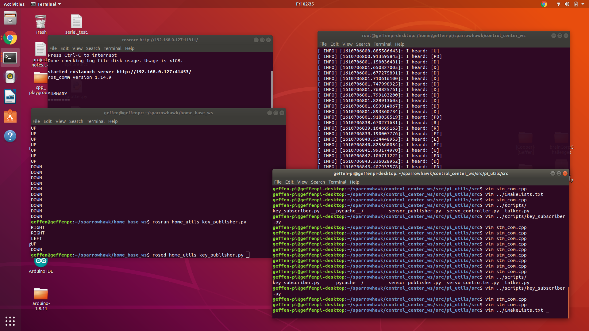
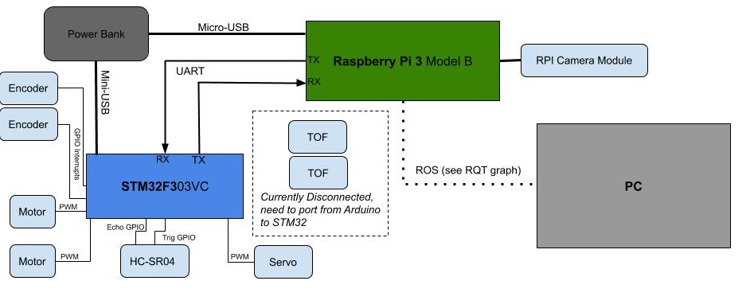
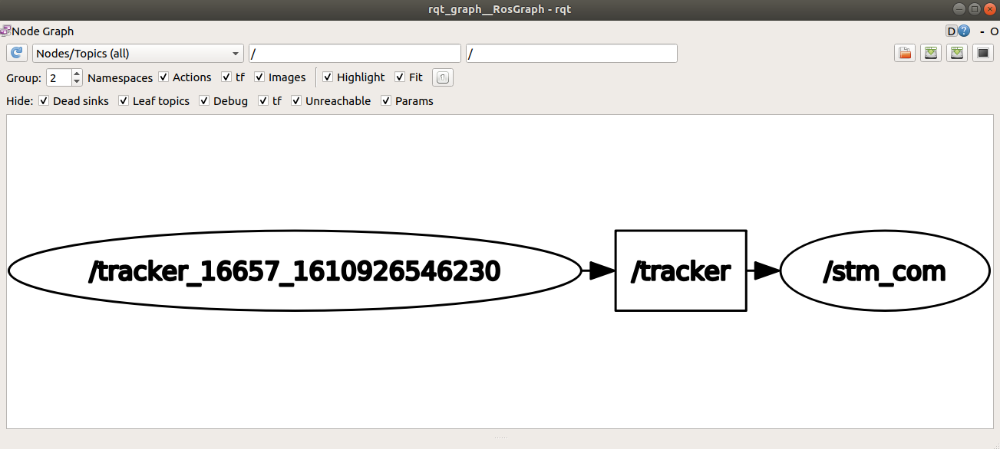

# sparrowhawk
This is the overarching repo for the "sparrowhawk" project, a robot car with simple autonomous driving capabilities.  
*Sparrowhawk is the name of the rc car used for the robot's chassis*
## Repo Structure
* At the top level of the repo there are generic files including *old* arduino code. I recently have been porting the peripheral interface to STM32. The repo can be found here: https://github.com/geffencooper/STM32_peripheral_code
* There are two subdirectories within the top level for the two components of the project. Each of these directories is a **ros workspace**
* The first one is the **laptop** workspace called **home_base_ws**
    * This is main access point in which we can communicate with the robot (by talking with the RPI) using ROS
    * All computer vision related tasks are executed on the laptop which accesses the video stream from the RPI through *uv4l*
* The second one is the **raspberry pi** workspace called **control_center_ws**
    * This is where all the action happens and where the robot is directly controlled
    * All decision making is executed from the pi which controls the motors by sending messages over UART to the STM32
## Using the Repo  
This shows an example workflow. Roscore is running and the two workspaces are open from the PC and RPI (over SSH).

In this project there are two different computers, the laptop and the Raspberry Pi so one must be assigned as the "ROS master" (In this case the laptop is the master).
* Within each workspace src folder we have **ros packages** which are the software building blocks that contain all the useful tools we need
* Within **home_base_ws** we have the **home_utils** package which contains all the ros nodes, scripts, and files needed to communicate with the robot and CV tasks
* Within **control_center_ws** we have the **rpi_utils** package which contains all the ros nodes, scripts, and files needed to control the robot 

## Diagrams  

### Hardware Blocks
This diagram shows a high level hardware layout.  
  

### Example ROS RQT Graph  
Here we have a node called "tracker" on the PC that is doing object detection and publishing the bounding box details to a topic called "tracker." The "stm_com" node on the RPI, which is the communication interface to the STM32, subscribes to the "tracker" topic and uses the information to transition through a state machine.
  

### Robot State Machine  
Whenever the "stm_com" node gets a new message from the "tracker" node it transitions through this state machine. Using the bounding box coordinates and area, it makes decision based on how an object is oriented in the field of view.
